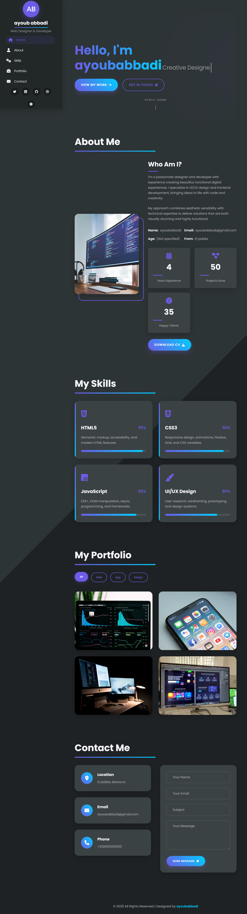

  

  
  
  
  

<h1 align="center"> Advanced Front-End Portfolio Challenge</h1>

Welcome, developer! This repository isn't just code; it's a high-level test of your front-end skills. Your mission is to build a modern, fully-interactive, and responsive portfolio website from scratch, guided *only* by the screenshot below.

This challenge will test your mastery of HTML, CSS, and modern JavaScript, forcing you to think about architecture, responsiveness, and user experience.

---

##  Table of Contents

* [The Challenge](#-the-challenge)
* [The Target Design](#-the-target-design)
* [Core Features Checklist](#-core-features-checklist)
* [Technology Stack](#-technology-stack)
* [How to Participate](#-how-to-participate)
* [View the Solution](#solution)

---

##  The Challenge

* **Goal:** Recreate the portfolio website shown in the screenshot.
* **Source:** You must work *only* from the target design. Do not look at the solution code!
* **Structure:** You *must* separate your code into three distinct files:
    1.  `index.html` (for semantic structure)
    2.  `style.css` (for all styling)
    3.  `script.js` (for all interactivity)

---

##  The Target Design

Your build must be a pixel-perfect match of the design below, including both **desktop** and **mobile** layouts.

---

##  Core Features Checklist

Use this checklist to ensure your final product is fully functional.

###  UI/UX & Design
* [ ] **Responsive Design:** The site must look perfect on all screen sizes (desktop, tablet, and mobile).
* [ ] **Dark/Light Mode:** A theme-toggle button that switches the color palette.
* [ ] **Mobile Navigation:** A "hamburger" menu that slides in on mobile.
* [ ] **"Back to Top" Button:** A button that appears on scroll and smoothly returns the user to the top.
* [ ] **Hover & Focus States:** All interactive elements (links, buttons, cards) must have clear hover and focus states.
* [ ] **Form Validation:** The contact form must show visual error messages for invalid inputs.

###  Interactive Functionality
* [ ] **Typing Effect:** The homepage heading ("I am a...") must have an animated typing/deleting effect.
* [ ] **Animated Counters:** The "About Me" stats (e.g., "4 Years Experience") and "Skill" percentages must count up from 0 when they scroll into view.
* [ ] **Scroll Animations:** All page sections must fade in or slide in as they are scrolled to (using `IntersectionObserver`).
* [ ] **Active Nav Link:** The current section's link in the sidebar must automatically highlight.
* [ ] **Portfolio Filtering:** The portfolio items must filter with a smooth animation.
* [ ] **Form Loading State:** The "Send" button must show a spinner and be disabled while "submitting".
* [ ] **Toast Notifications:** The form must show a success/error message (no `alert()`!).

---

##  Technology Stack

This challenge is built with the fundamentals of the web. No frameworks allowed!

* **HTML5:** For semantic markup and accessibility.
* **CSS3:** For modern layouts (Flexbox, Grid), variables, and animations.
* **JavaScript (ES6+):** For all interactivity (DOM manipulation, `IntersectionObserver`, `localStorage`, Event Listeners).

---

##  How to Participate

1.  **Fork this Repository:** Click the "Fork" button at the top right to create your own copy.
2.  **Clone Your Fork:** `git clone https://github.com/ayoubabbadi/Advanced-Portfolio-Challenge.git`
3.  **Create Your Files:** In the root directory, create `index.html`, `style.css`, and `script.js`.
4.  **Start Building!** Open `index.html` in your browser and start coding. Use the screenshot and the feature checklist as your guide.
5.  **Test Your Work:** Make sure it's fully responsive and all interactive features work.
6.  **Submit Your Solution (Optional):** Want feedback? Open a **Pull Request** to this repository. I'll review your code and offer suggestions.

---

## Solution

Stuck? Finished? Compare your work with the official solution.

**[ Click here to view the complete solution code.](./solution)**

*Try to complete the challenge yourself before you peek!*

---

  <small>Distributed under the MIT License. See `LICENSE` for more information.</small>

